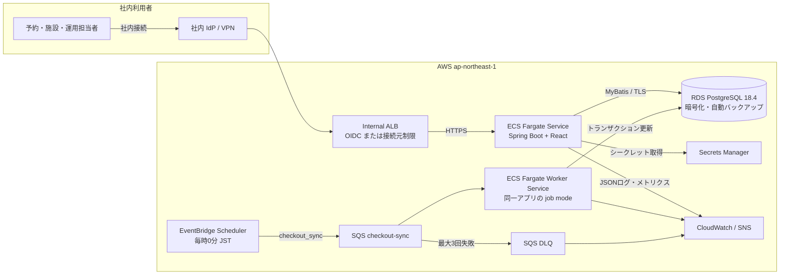

# 設計書 — 白馬樹海 民宿管理システム

**作成日**: 2026-07-14  
**設計基準**: 現行コードを事実基線とし、本番目標構成を追記  
**対象読者**: 実装担当者、インフラ担当者、レビュー担当者

## 概要

本システムは、民宿の予約、同行者、客室、清掃状態、期間別料金を社内 Web 画面で管理する業務システムである。現行は Spring MVC が React shell を返し、React が `/api` 配下の JSON API を呼び出す。Controller、Service、MyBatis Mapper、PostgreSQL の層構成を維持しつつ、法定宿泊者名簿、認証・権限、監査、AWS 配備、定期処理の一意実行を追加する。

## 技術的実現可否

**判断: 条件付き対応可能**

主要 CRUD、料金計算、予約重複防止、状態同期、ページング、定期チェックアウトは実装済みであり、`npm run check` と `mvn test`（106件）が成功した。条件は、旅館業法上の記録項目と三年保存、本人認証、物理削除制御、PostgreSQL 実機 CI、複数タスク時の定期処理重複防止を本番前に解消することである。

## アーキテクチャ図

## 現行構成と目標構成

| 項目        | 現行                       | 本番目標                                                   |
| ----------- | -------------------------- | ---------------------------------------------------------- |
| Java        | Java 17 LTS                | Java 25 LTS。移行までは17をパッチ更新                      |
| Spring Boot | 3.3.5                      | 3.5.14 系へ段階更新。4.1 移行は別案件                      |
| React       | 19.2.7                     | 19.2.7 を固定し更新試験を実施                              |
| Node.js     | ローカル環境依存           | Node.js 24 LTS をビルド環境で固定                          |
| MyBatis     | Starter 3.0.4              | Boot 3.5 期間は3.0系。Boot 4移行時に4.0系                  |
| PostgreSQL  | Docker PostgreSQL 16       | RDS PostgreSQL 18.4、初期は Single-AZ、要件により Multi-AZ |
| DB変更      | Flyway V1 baseline         | Flyway の forward-only migration、CIで実 PostgreSQL 検証   |
| 定期処理    | `@Scheduled`、アプリ内実行 | EventBridge Scheduler → SQS → Worker Service               |
| 認証        | アプリ内認証なし           | 社内 IdP OIDC + RBAC。暫定でも VPN/固定IPを必須化          |

バージョン根拠: React 公式は 19.2.7 を最新 19.2 系として掲載し、Spring Boot 3.5 系の最新リリースは 3.5.14、PostgreSQL 公式と RDS は 18.4 をサポートしている。Java 25 は LTS、Node.js 24 は LTS である。

## アーキテクチャ方針

### フロントエンド

- React 19.2.7 + ReactDOM 19.2.7 + esbuild 0.28 系を使用する。
- `/dashboard`、`/reservations`、`/rooms`、`/prices` は同一 `app.html` を返し、URL に応じて画面を切り替える。
- API 呼び出しは same-origin とし、CSRF Cookie と `X-XSRF-TOKEN` ヘッダーを維持する。
- 入力値は画面で即時検証するが、業務判定の正本は Service/DB とする。
- WCAG 2.2 AA を目標に、キーボード操作、フォーカス、エラー関連付け、表の見出しを確認する。

### バックエンド

- Java 17 / Spring Boot 3.3.5 の現行動作を基線とし、まず 3.5.14 へ更新する。
- Controller は HTTP 入出力、Service は業務規則とトランザクション、Mapper XML は SQL に限定する。
- 更新 API は JSON の統一エラー形式を返し、`request_id` をログとレスポンスで相関させる。
- 定期処理は `APP_MODE=web|checkout-worker` で起動責務を分離する。軽量なWorker ServiceがSQSを長pollし、業務処理成功後にだけmessageを削除する。移行完了後はWeb modeの `@Scheduled` を無効化する。

### インフラ（AWS）

- 東京リージョン、2 AZ の VPC を使用する。
- Internal ALB + ECS Fargate Service 1〜2タスク。利用は社内 VPN/Direct Connect または認証プロキシ経由に限定する。
- RDS PostgreSQL は暗号化、TLS、7〜35日自動バックアップ、削除保護を有効にする。
- DB 認証情報は Secrets Manager、非秘密設定は SSM Parameter Store に保存する。
- ECR、GitHub Actions OIDC、CloudWatch Logs、CloudWatch Alarm、SNS/Slack を利用する。
- 開発・検証・本番を別環境とし、IaC（AWS CDK または Terraform）で差分管理する。

### データ設計

主要エンティティは `rooms`、`reservations`、`reservation_guests`、`room_price_rules` である。目標設計では `users`、`audit_logs`、`jobs`、`guest_documents` を追加する。宿泊者名簿として使う場合、代表者・同行者に住所と連絡先を保持し、外国人宿泊者には国籍、旅券番号、旅券写しオブジェクトキーを追加する。

## 機能一覧と工数見積もり

現行資産活用後の本番化残工数を三点見積もりの通常値で積み上げた。

|   # | 機能                      | 内容                                     | 工数（人日） | 備考                      |
| --: | ------------------------- | ---------------------------------------- | -----------: | ------------------------- |
|   1 | 法令・保持設計            | 宿泊者名簿、三年保存、削除・提出手順     |            6 | 自治体差分確認を含む      |
|   2 | 認証・RBAC                | IdP連携、3ロール、認可試験               |            8 | 高優先                    |
|   3 | 宿泊者名簿拡張            | 住所、連絡先、国籍、旅券、CSV出力        |           10 | S3暗号化を含む            |
|   4 | 既存業務整合              | 予約・客室・料金・削除ルール再整理       |            6 | 現行資産再利用            |
|   5 | UI・アクセシビリティ      | 入力支援、エラー、キーボード、帳票       |            7 | 4画面                     |
|   6 | 定期処理分離              | EventBridge、SQS、Worker、DLQ            |            6 | 冪等性を含む              |
|   7 | AWS/IaC                   | ALB、ECS、RDS、Secrets、環境分離         |            9 | dev/stg/prod              |
|   8 | CI/CD・運用               | 実PostgreSQL、Flyway、バックアップ、監視 |            7 | 復元演習を含む            |
|     | **実装 小計**             |                                          |       **59** |                           |
|  T1 | 単体テスト                | Service、認可、変換、Worker              |            5 | JUnit 5                   |
|  T2 | 結合テスト                | API + PostgreSQL + Flyway + SQS          |            7 | Testcontainers/LocalStack |
|  T3 | E2E / システムテスト      | 予約・取消・退房・名簿出力               |            5 | Playwright                |
|  T4 | 性能・セキュリティ        | k6、OWASP基本、権限逸脱                  |            3 | 受入前                    |
|  T5 | テスト環境構築            | CI、シード、staging                      |            4 |                           |
|     | **テスト 小計**           |                                          |       **24** |                           |
|     | **合計（実装 + テスト）** |                                          |       **83** |                           |
|     | **バッファ（25%）**       |                                          |       **21** | 法令・移行不確実性        |
|     | **総合計**                |                                          |  **104人日** | 2名で約11週間             |

## フェーズ計画

| フェーズ | スコープ                                  | 完了条件                        |
| -------- | ----------------------------------------- | ------------------------------- |
| 0        | 法令、自治体、認証、SLA、データ保持を確定 | 高優先質問に回答、ADR承認       |
| 1        | 認証/RBAC、名簿項目、監査、削除制御       | 権限別受入、三年保存・出力可能  |
| 2        | AWS/IaC、RDS移行、CI/CD、バックアップ     | stagingで復元・ロールバック確認 |
| 3        | 非同期ジョブ、監視、E2E、性能、運用引継ぎ | SLO達成、運用手順承認、本番判定 |

## 不明点・確認事項

- 法定宿泊者名簿を本システムで完結させるか。
- 利用自治体が追加で求める名簿項目、保存・提出形式は何か。
- 物理削除を許可するデータと承認者をどう定義するか。
- 社内 IdP、VPN、Slack ワークスペース、AWS アカウント構成は利用可能か。
- 期待件数、ピーク同時利用者、SLA/RPO/RTO は何か。

## リスク・考慮事項

- 住所・連絡先・外国人宿泊者項目の不足は法令適合上の阻断事項である。
- `permitAll` のまま外部到達可能にしてはならない。認証導入前はネットワーク境界を必須とする。
- 取消済み・退房済み予約の物理削除は、法定保存対象を分離した後にのみ許可する。
- Spring Boot 4.1 / MyBatis Starter 4.0 への同時更新は変更範囲が大きいため、本番化とは分離する。
- PostgreSQL の排他制約 `btree_gist` は RDS で事前検証し、Flyway 実行ロールに必要権限を付与する。

## 公式参照

- React Versions: https://react.dev/versions
- Spring Boot Releases: https://github.com/spring-projects/spring-boot/releases
- Java SE Support Roadmap: https://www.oracle.com/java/technologies/java-se-support-roadmap.html
- Node.js Releases: https://nodejs.org/en/about/previous-releases
- PostgreSQL Versioning Policy: https://www.postgresql.org/support/versioning/
- Amazon RDS PostgreSQL Release Calendar: https://docs.aws.amazon.com/AmazonRDS/latest/PostgreSQLReleaseNotes/postgresql-release-calendar.html
