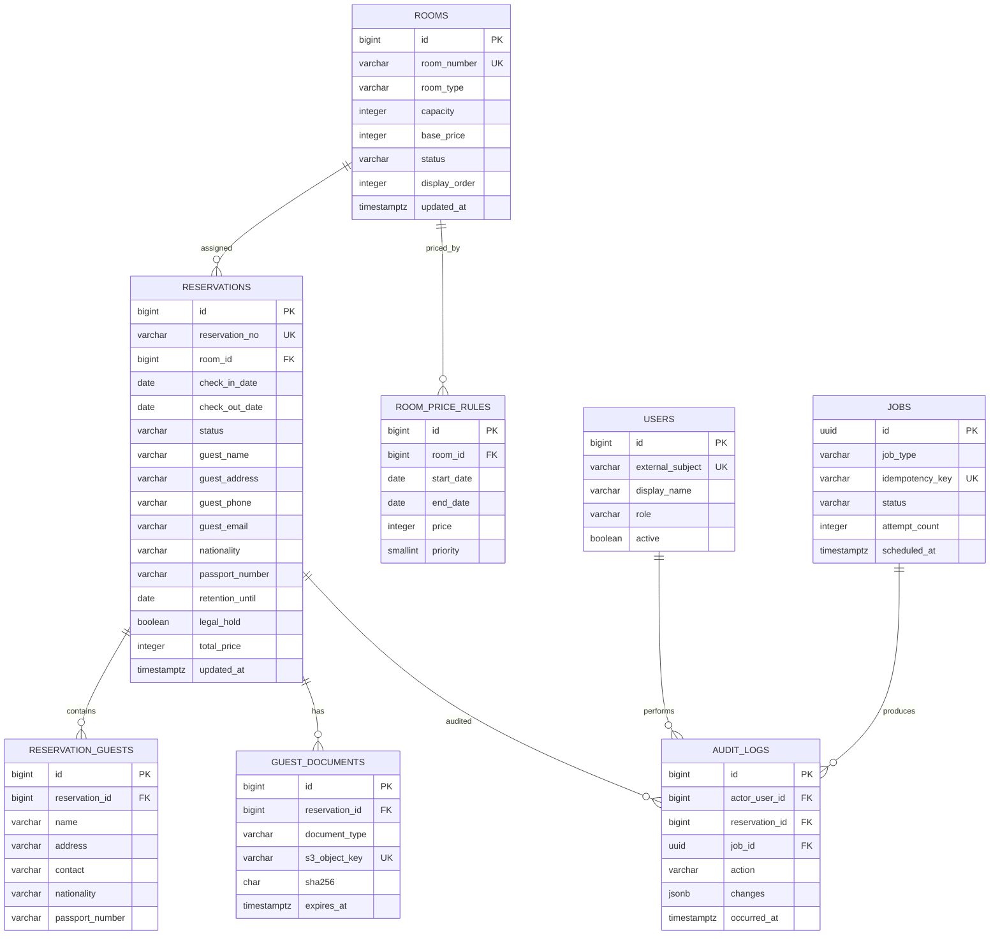

# DB設計書 — 白馬樹海 民宿管理システム

**作成日**: 2026-07-14  
**対象DB**: PostgreSQL 18.4（本番目標）／PostgreSQL 16（現行開発環境）  
**変更管理**: Flyway（forward-only）

## 1. 設計方針

- 現行の `rooms`、`reservations`、`reservation_guests`、`room_price_rules` と `checkout_reservations` View を基線とする。
- 旅館業法上の宿泊者名簿として利用する場合、氏名、住所、連絡先を保存し、日本国内に住所を持たない外国人は国籍・旅券番号を追加する。
- 法定記録と業務予約を論理的に分け、取消・退房後も法定保存期限まで物理削除しない。
- 日時はDBでは `timestamptz`、業務日付は `date`、金額は円単位の `integer`、文字コードはUTF-8とする。
- 個人情報を含む列をログへ出力しない。RDS、バックアップ、S3文書はKMSで暗号化し、接続はTLSを必須とする。

## 2. DBサービス選定

| 候補                      | 適合性                                                       | 評価     |
| ------------------------- | ------------------------------------------------------------ | -------- |
| Amazon RDS for PostgreSQL | 現行SQL、Flyway、MyBatis、排他制約を維持でき、運用負荷が低い | **採用** |
| Aurora PostgreSQL         | 高可用・読取拡張に優れるが、初期規模に対して費用と運用が過大 | 将来候補 |
| DynamoDB                  | 日付範囲、結合、排他制約、帳票検索の再設計が必要             | 不採用   |

初期本番は東京リージョンの RDS PostgreSQL 18.4、Single-AZ、暗号化、削除保護、自動バックアップ7日を基準とする。停止許容が短い場合は Multi-AZ、バックアップ35日へ変更する。RPO/RTO確定後に最終決定する。

## 3. ER図

## 4. テーブル定義

### 4.1 `rooms`（現行・継続）

| カラム                  | 型          | NULL | 制約・既定値   | 説明           |
| ----------------------- | ----------- | ---: | -------------- | -------------- |
| id                      | bigint      |   No | PK, identity   | 客室ID         |
| room_number             | varchar(20) |   No | UNIQUE         | 客室番号       |
| room_type               | varchar(50) |   No |                | 客室種別       |
| capacity                | integer     |   No | CHECK 1以上    | 定員           |
| base_price              | integer     |   No | CHECK 0以上    | 基本料金（円） |
| status                  | varchar(20) |   No | `AVAILABLE` 等 | 客室状態       |
| display_order           | integer     |   No | DEFAULT 0      | 表示順         |
| note                    | text        |  Yes |                | 備考           |
| created_at / updated_at | timestamptz |   No | now()          | 監査日時       |

Index: `uk_rooms_room_number`、`idx_rooms_status_display_order(status, display_order)`。

### 4.2 `reservations`（現行拡張）

| カラム                         | 型           |   NULL | 制約・既定値     | 説明                                        |
| ------------------------------ | ------------ | -----: | ---------------- | ------------------------------------------- |
| id                             | bigint       |     No | PK, identity     | 予約ID                                      |
| reservation_no                 | varchar(30)  |     No | UNIQUE           | 表示用予約番号                              |
| room_id                        | bigint       |     No | FK rooms         | 客室ID                                      |
| check_in_date / check_out_date | date         |     No | `in < out`       | 宿泊期間                                    |
| status                         | varchar(20)  |     No | CHECK            | `RESERVED/CHECKED_IN/CHECKED_OUT/CANCELLED` |
| guest_name                     | varchar(120) |     No |                  | 代表者氏名                                  |
| guest_address                  | varchar(300) | 条件付 | 新規             | 代表者住所。名簿利用時必須                  |
| guest_phone                    | varchar(40)  | 条件付 | 新規             | 電話等の連絡先                              |
| guest_email                    | varchar(254) |    Yes | 新規             | メール                                      |
| nationality                    | varchar(80)  | 条件付 | 新規             | 国内住所のない外国人は必須                  |
| passport_number                | varchar(50)  | 条件付 | 新規、暗号化検討 | 同上                                        |
| adult_count / child_count      | integer      |     No | CHECK 0以上      | 人数                                        |
| total_price                    | integer      |     No | CHECK 0以上      | 確定料金                                    |
| retention_until                | date         | 条件付 | 新規             | 名簿の物理削除禁止日                        |
| legal_hold                     | boolean      |     No | DEFAULT false    | 調査等による保持                            |
| deleted_at                     | timestamptz  |    Yes | 新規             | 業務上の論理削除                            |
| created_at / updated_at        | timestamptz  |     No | now()            | 監査日時                                    |

重複予約は現行の `btree_gist` と exclusion constraint を維持し、`CANCELLED` と論理削除済みを除く期間重複を禁止する。Index: `idx_reservations_room_period`、`idx_reservations_status_checkout`、`idx_reservations_retention`。検索用Indexへ氏名・旅券番号を安易に含めない。

### 4.3 `reservation_guests`（現行拡張）

| カラム                  | 型           |   NULL | 制約                   | 説明     |
| ----------------------- | ------------ | -----: | ---------------------- | -------- |
| id                      | bigint       |     No | PK                     | 同行者ID |
| reservation_id          | bigint       |     No | FK、ON DELETE RESTRICT | 予約ID   |
| name                    | varchar(120) |     No |                        | 氏名     |
| address                 | varchar(300) | 条件付 | 新規                   | 住所     |
| contact                 | varchar(254) | 条件付 | 新規                   | 連絡先   |
| nationality             | varchar(80)  | 条件付 | 新規                   | 国籍     |
| passport_number         | varchar(50)  | 条件付 | 新規                   | 旅券番号 |
| sort_order              | smallint     |     No | DEFAULT 0              | 表示順   |
| created_at / updated_at | timestamptz  |     No |                        | 監査日時 |

Index: `idx_reservation_guests_reservation(reservation_id, sort_order)`。

### 4.4 `room_price_rules`（現行・継続）

| カラム                | 型           | NULL | 制約         | 説明         |
| --------------------- | ------------ | ---: | ------------ | ------------ |
| id                    | bigint       |   No | PK           | 料金規則ID   |
| room_id               | bigint       |   No | FK rooms     | 客室         |
| start_date / end_date | date         |   No | start <= end | 適用期間     |
| price                 | integer      |   No | CHECK 0以上  | 1泊料金      |
| priority              | smallint     |   No | DEFAULT 0    | 競合時優先度 |
| label                 | varchar(100) |  Yes |              | 表示名       |

同一客室・同一優先度の期間重複を exclusion constraint で禁止する。

### 4.5 新規テーブル

| テーブル        | 主な列・制約                                                                                 | 用途                                           |
| --------------- | -------------------------------------------------------------------------------------------- | ---------------------------------------------- |
| users           | `id`, `external_subject UNIQUE`, `display_name`, `role CHECK(ADMIN,MANAGER,STAFF)`, `active` | IdP主体とアプリ権限の対応                      |
| guest_documents | `reservation_id FK`, `document_type`, `s3_object_key UNIQUE`, `sha256`, `expires_at`         | 旅券写し等のメタデータ。ファイル本体は非公開S3 |
| audit_logs      | actor/job、対象、action、`changes jsonb`、request_id、時刻                                   | 追記専用監査。機微値はマスク                   |
| jobs            | UUID、job_type、idempotency_key UNIQUE、status、試行数、予定/開始/終了日時、error_code       | 非同期処理の状態・冪等性                       |

`audit_logs` と `jobs` の詳細は `04.detail-design.md`、`08.job-api-design.md` を正とする。

## 5. View

`checkout_reservations` は、`status IN ('RESERVED','CHECKED_IN')` かつ `check_out_date <= CURRENT_DATE` の対象を返す現行Viewである。WorkerではこのViewを候補抽出に使い、更新時に行ロックと状態再判定を行う。タイムゾーンはDBセッションを `Asia/Tokyo` に固定する。

## 6. 保持・削除設計

| データ         | 保存期間                             | 削除方法                                                     |
| -------------- | ------------------------------------ | ------------------------------------------------------------ |
| 法定宿泊者名簿 | 作成日から最低3年                    | `retention_until` 経過、legal_hold=false、管理者承認後に削除 |
| 旅券写し       | 法令・自治体・運用目的を確認後に設定 | S3 LifecycleとDBメタデータを同じ承認ジョブで削除             |
| 監査ログ       | 原則7年（要承認）                    | 月次パーティション単位、改ざん防止保管                       |
| ジョブ履歴     | オンライン90日、集約ログ1年          | 日次クリーンアップ                                           |
| バックアップ   | 7〜35日                              | RDS自動期限。削除要求時の残存期間を説明                      |

予約取消APIは状態を `CANCELLED` にするだけで、法定保存期間内の行を物理削除しない。個人情報削除は業務予約、法定名簿、監査、バックアップを区別して記録する。

## 7. マイグレーション方針

| Version | 内容                                                   | ロールバック                 |
| ------- | ------------------------------------------------------ | ---------------------------- |
| V2      | 個人情報・保持列をNULL許容で追加、users/audit_logs作成 | 旧アプリと共存可能           |
| V3      | guest_documents/jobs、Index、状態制約を追加            | 新機能をfeature flagで停止   |
| V4      | 既存データ補完、NOT NULL/条件制約、削除RESTRICT        | 事前スナップショットから復元 |
| V5      | checkout View更新、アプリ内scheduler停止後の整理       | Workerを停止し旧Viewへ戻す   |

- Flyway SQLは一度適用したファイルを変更せず、新しいVersionで訂正する。
- CIは空DBへの全適用とV1データからのアップグレードをPostgreSQL実機で検証する。
- 大量更新はexpand → backfill → contractに分割し、ロック時間を計測する。
- 本番前にスナップショット、`flyway validate`、バックアップ復元を実施する。

## 8. バックアップ・可用性

- 自動バックアップ7日、日次スナップショット、四半期ごとの復元演習を初期値とする。
- RPO 24時間／RTO 4時間を仮定する。要求が厳しい場合はMulti-AZ、PITR、クロスリージョンコピーを追加する。
- 接続数はHikariCPをタスク当たり10以下から開始し、RDS最大接続数の70%を上限とする。
- `SELECT`/更新の遅延、空きストレージ、接続数、deadlock、replication lag（Multi-AZ時）を監視する。

## 9. 未決事項

- 本システムを法定宿泊者名簿の正本とするか、別の紙・台帳を正本とするか。
- 自治体が求める追加項目、旅券写しの保存期間と提出方法。
- 個人情報の暗号化列、検索要件、削除承認者、監査ログ保存年数。
- SLA/RPO/RTO、Multi-AZ採用、将来の予約件数とデータ増加率。
