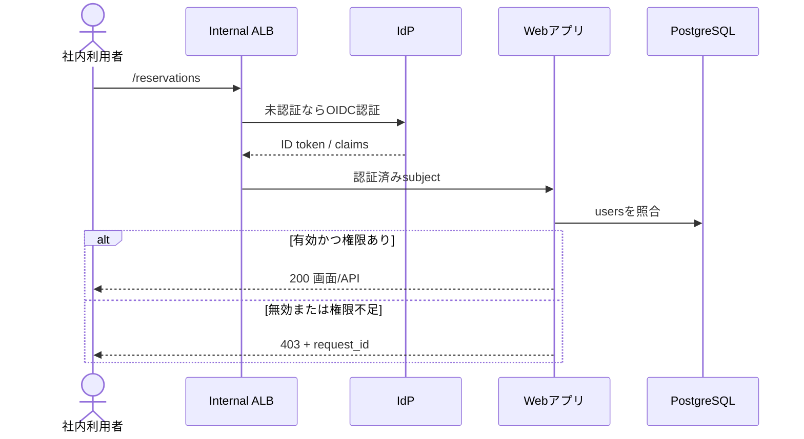
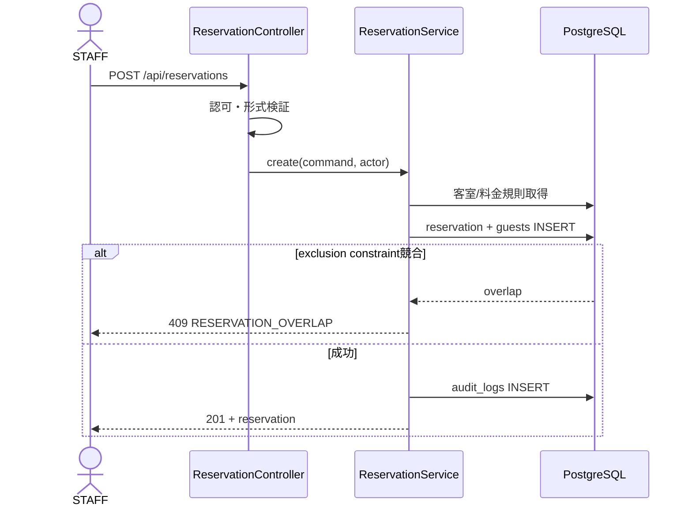
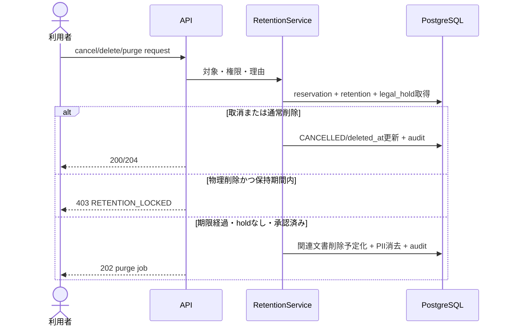
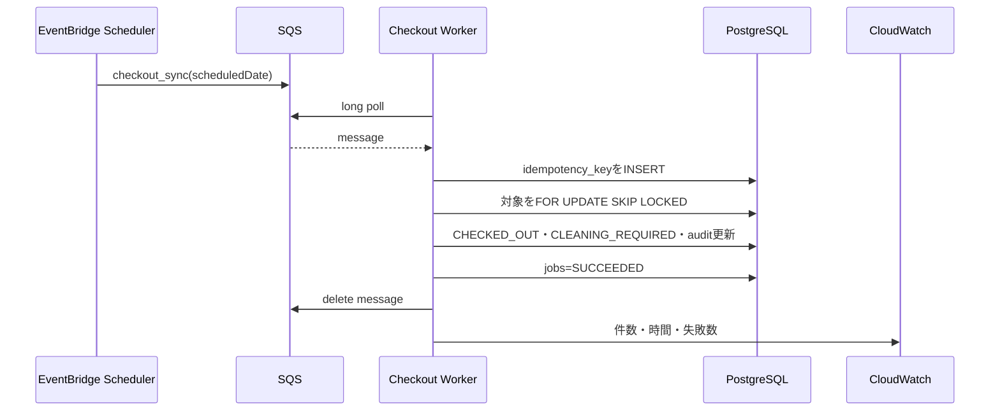

# 詳細設計書 — 白馬樹海 民宿管理システム

**作成日**: 2026-07-14  
**前提文書**: `02.design-doc.md`、`03.db-design.md`  
**対象**: Web/API、認証・認可、法定名簿、ジョブ連携

## 1. コンポーネント責務

| 層     | 実装                  | 責務                                                       |
| ------ | --------------------- | ---------------------------------------------------------- |
| UI     | React / esbuild       | 4画面、入力検証、CSRF付与、エラー表示。業務判定は行わない  |
| Web    | Spring MVC Controller | JSON変換、Bean Validation、HTTP status、認可アノテーション |
| 業務   | Service               | トランザクション、料金計算、状態遷移、保持・削除判定       |
| 永続化 | MyBatis Mapper/XML    | PostgreSQL SQL、行ロック、ページング                       |
| DB     | PostgreSQL/Flyway     | 整合性制約、排他制約、監査・保持データ                     |
| Job    | SQS + ECS Worker      | 毎時チェックアウト、冪等実行、再試行                       |

パッケージは `controller`、`service`、`domain`、`mapper`、`security`、`job` を基本とする。ControllerからMapperを直接呼ばない。

## 2. 画面設計

| URL             | 画面           | 主機能                             | 許可ロール                 |
| --------------- | -------------- | ---------------------------------- | -------------------------- |
| `/dashboard`    | ダッシュボード | 本日到着・出発、在室、要清掃、警告 | STAFF以上                  |
| `/reservations` | 予約管理       | 検索、登録、入退室、取消、名簿出力 | STAFF以上。物理削除はADMIN |
| `/rooms`        | 客室管理       | 登録、状態、論理削除、復元         | MANAGER以上                |
| `/prices`       | 料金管理       | 期間料金の登録・削除               | MANAGER以上                |

全画面でキーボード操作、明示的label、エラー概要と対象項目の関連付け、処理中の二重送信防止、セッション期限通知を実装する。個人情報は一覧で最小表示とし、旅券番号は末尾4桁以外をマスクする。

## 3. 認証・認可

- Internal ALBのOIDCまたはSpring Security OAuth2 Clientで社内IdPへリダイレクトする。
- IdPの`sub`を `users.external_subject` に対応させる。未登録・無効ユーザーは403とする。
- ロールは `STAFF < MANAGER < ADMIN`。更新APIはCSRF保護、same-origin Cookieは `Secure; HttpOnly; SameSite=Lax` とする。
- 暫定的にOIDCを用意できない場合も、VPN/固定IP + リバースプロキシ認証の双方を満たすまで外部公開しない。
- 認可失敗、ログイン、名簿閲覧、CSV出力、削除、権限変更を監査ログへ記録する。



## 4. API共通仕様

- Base path: `/api`、JSON UTF-8、日付 `YYYY-MM-DD`、日時 ISO 8601（UTC出力）、金額は整数円。
- 更新要求は `Content-Type: application/json`、`X-XSRF-TOKEN`、`X-Request-Id`（任意）を受ける。
- 一覧は `page`（0開始）、`size`（既定20、最大100）、`sort`を使用する。
- 作成成功は201、読取・更新は200、非同期受付は202、削除成功は204を目標とする。現行POST APIの互換性は移行期間維持する。
- 更新競合防止に `updatedAt` を受け、0件更新なら409を返す。

### 4.1 統一エラー

```json
{
  "timestamp": "2026-07-14T03:00:00Z",
  "status": 409,
  "code": "RESERVATION_OVERLAP",
  "message": "指定期間は予約済みです。",
  "fieldErrors": [{ "field": "checkInDate", "code": "overlap" }],
  "requestId": "01J..."
}
```

| HTTP | code例                                    | 条件                         |
| ---: | ----------------------------------------- | ---------------------------- |
|  400 | `VALIDATION_ERROR`, `INVALID_STATE`       | 形式・状態遷移不正           |
|  401 | `AUTHENTICATION_REQUIRED`                 | 未認証                       |
|  403 | `ACCESS_DENIED`, `RETENTION_LOCKED`       | 権限不足・法定保持中         |
|  404 | `ROOM_NOT_FOUND`, `RESERVATION_NOT_FOUND` | 対象なし                     |
|  409 | `RESERVATION_OVERLAP`, `STALE_UPDATE`     | DB競合・楽観ロック           |
|  422 | `BUSINESS_RULE_VIOLATION`                 | 人数超過、日付、料金規則不正 |
|  429 | `RATE_LIMITED`                            | 過剰要求                     |
|  500 | `INTERNAL_ERROR`                          | 想定外。詳細を返さない       |
|  503 | `DEPENDENCY_UNAVAILABLE`                  | DB/IdP等の一時障害           |

`@RestControllerAdvice` で変換し、ログはJSONで `request_id`、actor、route、result、latencyを出す。氏名、住所、連絡先、旅券番号、Cookie、tokenを出力しない。

## 5. API一覧

### 5.1 現行互換API

| Method | Path                                    | 入力概要                          | 出力概要                  | 権限    |
| ------ | --------------------------------------- | --------------------------------- | ------------------------- | ------- |
| GET    | `/dashboard`                            | `date?`                           | KPI、到着・出発、客室状態 | STAFF   |
| GET    | `/rooms`                                | `includeDeleted?`                 | 客室一覧                  | STAFF   |
| POST   | `/rooms`                                | 客室番号、種別、定員、基本料金    | 客室                      | MANAGER |
| POST   | `/rooms/{id}/statuses`                  | status、updatedAt                 | 客室                      | STAFF   |
| POST   | `/rooms/{id}/delete`                    | reason                            | 論理削除結果              | MANAGER |
| POST   | `/rooms/{id}/restore`                   | updatedAt                         | 客室                      | MANAGER |
| POST   | `/rooms/{id}/delete-permanently`        | approvalReason                    | なし                      | ADMIN   |
| GET    | `/prices`                               | roomId、期間                      | 料金規則一覧              | STAFF   |
| POST   | `/prices`                               | roomId、期間、price、priority     | 料金規則                  | MANAGER |
| POST   | `/prices/{id}/delete`                   | updatedAt                         | なし                      | MANAGER |
| POST   | `/prices/delete-selected`               | ids[]                             | 削除件数                  | MANAGER |
| GET    | `/reservations`                         | 日付、status、keyword、page、size | 予約Page                  | STAFF   |
| POST   | `/reservations`                         | 予約・代表者・同行者              | 予約                      | STAFF   |
| POST   | `/reservations/{id}/payment`            | paymentStatus、updatedAt          | 予約                      | STAFF   |
| POST   | `/reservations/{id}/cancel`             | reason、updatedAt                 | 予約                      | STAFF   |
| POST   | `/reservations/{id}/delete`             | reason、updatedAt                 | 論理削除                  | MANAGER |
| POST   | `/reservations/{id}/delete-checked-out` | reason                            | 論理削除                  | MANAGER |
| POST   | `/reservations/{id}/status`             | status、updatedAt                 | 予約                      | STAFF   |
| POST   | `/reservations/{id}/cleaning`           | cleaningStatus、updatedAt         | 予約/客室                 | STAFF   |

### 5.2 追加API

| Method | Path                                        | 用途                        | 権限    |
| ------ | ------------------------------------------- | --------------------------- | ------- |
| GET    | `/me`                                       | ログインユーザー・権限      | STAFF   |
| GET    | `/reservations/{id}`                        | 名簿を含む詳細              | STAFF   |
| GET    | `/reservations/{id}/ledger.csv`             | 宿泊者名簿CSV出力           | MANAGER |
| POST   | `/reservations/{id}/documents`              | 旅券写しアップロードURL発行 | MANAGER |
| DELETE | `/reservations/{id}/documents/{documentId}` | 保持条件を満たす文書削除    | ADMIN   |
| POST   | `/reservations/{id}/purge-requests`         | 物理削除申請                | ADMIN   |
| GET    | `/admin/jobs`                               | ジョブ状態検索              | ADMIN   |
| POST   | `/admin/jobs/checkout-sync`                 | 手動再実行                  | ADMIN   |

## 6. 主要API詳細

### 6.1 予約作成 `POST /api/reservations`

Request主要項目:

| 項目                             |   必須 | 検証                       |
| -------------------------------- | -----: | -------------------------- |
| roomId                           |    Yes | 有効な客室、論理削除なし   |
| checkInDate / checkOutDate       |    Yes | in < out、上限365泊        |
| guest.name/address/contact       |    Yes | 1〜120/300/254文字         |
| guest.hasDomesticAddress         |    Yes | boolean                    |
| guest.nationality/passportNumber | 条件付 | 国内住所のない外国人は必須 |
| adultCount / childCount          |    Yes | 合計1以上、客室定員以下    |
| companions[]                     |     No | 代表者を除く宿泊者         |

Responseは201で予約詳細、`Location: /api/reservations/{id}` を返す。料金は各宿泊日の最優先 `room_price_rules`、なければ `base_price` を合計する。クライアント送信価格は信用しない。



### 6.2 予約状態変更 `POST /api/reservations/{id}/status`

許可遷移は `RESERVED → CHECKED_IN → CHECKED_OUT`、`RESERVED/CHECKED_IN → CANCELLED`。逆遷移はMANAGERの訂正操作と理由を必要とし、監査する。`SELECT ... FOR UPDATE` 後に状態と`updatedAt`を再確認する。退房時は客室を `CLEANING_REQUIRED` にする。

### 6.3 取消・削除



現行の `delete-permanently` と `delete-checked-out` は互換経路として残すが、保持対象に対する直接DELETEを禁止し、`purge-requests`へ委譲する。

### 6.4 名簿CSV `GET /api/reservations/{id}/ledger.csv`

UTF-8 BOM付きCSV、RFC 4180準拠。氏名、住所、連絡先、宿泊日、国籍、旅券番号（該当者）を出力し、`Cache-Control: no-store` とする。出力者、対象、件数、用途を監査する。Excel数式注入を避けるため先頭が `= + - @` の値を無害化する。

### 6.5 旅券写しアップロード

APIは5分有効のS3 pre-signed PUTを返す。PDF/JPEG/PNG、10MB以下、暗号化必須、公開ACL禁止。完了通知でサイズ、MIME、SHA-256を確認し、マルウェアスキャン成功後に利用可能にする。

## 7. チェックアウトジョブ連携



ジョブの詳細、再試行、DLQは `08.job-api-design.md` を正とする。

## 8. トランザクション・排他制御

- 予約作成/期間変更: `READ COMMITTED` + exclusion constraint。競合は409へ変換。
- 状態変更/削除: 対象行を `FOR UPDATE`。客室更新、監査ログまで単一トランザクション。
- Worker: 最大100件単位、`FOR UPDATE SKIP LOCKED`。1件失敗で全件を戻さず、対象単位で結果を記録する。
- 外部S3削除とDB変更は同一トランザクションにできないため、outbox相当のjobを作り、再実行可能にする。

## 9. 環境変数

| 変数                                        |       必須 | 例/既定値                 | 説明               |
| ------------------------------------------- | ---------: | ------------------------- | ------------------ |
| `APP_MODE`                                  |        Yes | `web` / `checkout-worker` | 起動責務           |
| `SPRING_PROFILES_ACTIVE`                    |        Yes | `prod`                    | 環境profile        |
| `JDBC_URL`                                  |        Yes | Secrets参照               | PostgreSQL TLS URL |
| `DB_USERNAME` / `DB_PASSWORD`               |        Yes | Secrets参照               | DB資格情報         |
| `APP_TIME_ZONE`                             |         No | `Asia/Tokyo`              | 業務日付           |
| `OIDC_ISSUER_URI`                           |        Yes | IdP URL                   | 認証発行者         |
| `OIDC_CLIENT_ID`                            |        Yes | Secrets参照               | client ID          |
| `SQS_CHECKOUT_QUEUE_URL`                    |     Worker | URL                       | 通常キュー         |
| `SQS_CHECKOUT_HIGH_QUEUE_URL`               |     Worker | URL                       | 緊急再実行キュー   |
| `S3_GUEST_DOCUMENT_BUCKET`                  | Web/Worker | bucket                    | 非公開文書         |
| `JOB_BATCH_SIZE`                            |         No | `100`                     | 1回の更新件数      |
| `JOB_VISIBILITY_TIMEOUT_SECONDS`            |         No | `450`                     | SQS可視性timeout   |
| `LOG_LEVEL`                                 |         No | `INFO`                    | 本番DEBUG禁止      |
| `MANAGEMENT_ENDPOINTS_WEB_EXPOSURE_INCLUDE` |         No | `health,prometheus`       | 内部監視のみ       |

秘密値を環境ファイルやGitへ保存しない。起動時に必要な値が欠けた場合はfail fastする。

## 10. セキュリティ・非機能

- TLS 1.2以上、HSTS、CSP、`X-Content-Type-Options`、frame禁止を維持する。
- 入力はBean Validation、SQLはMyBatis bind parameterのみ。CSV/HTML/ログの出力文脈でエスケープする。
- API body上限1MB、文書10MB。ログイン/CSV/文書APIにrate limitを設定する。
- 目標: 通常API p95 500ms以下、一覧 p95 1秒以下、月間可用性99.5%（暫定）。
- Healthはlivenessとreadinessを分離し、外部公開しない。readinessはDB接続を検査する。

## 11. テスト設計

| 区分        | 必須ケース                                                    |
| ----------- | ------------------------------------------------------------- |
| Unit        | 料金境界、人数、状態遷移、保持期限、外国人条件、権限          |
| Repository  | Flyway全適用、exclusion constraint、Index、時刻境界、同時更新 |
| API         | 200/400/401/403/404/409/422、CSRF、PII非露出、CSV注入         |
| Integration | PostgreSQL Testcontainers、SQS再試行、S3文書、OIDC claim      |
| E2E         | 予約→入室→退室→清掃、取消、名簿CSV、管理者削除申請            |
| Security    | IDOR、権限昇格、CSRF、XSS、SQL injection、session失効         |
| Performance | 50同時利用者、10万予約で検索p95、毎時500件checkout            |

本番判定では `npm run check`、`mvn test`、実PostgreSQL結合試験、E2E、Flyway validate、脆弱性scanをすべて成功させる。

## 12. 実装順序

1. V2 migration、OIDC/RBAC、統一エラーと監査基盤。
2. 名簿項目、CSV、旅券文書、保持・論理削除。
3. AWS staging、RDS移行、CI/CD、バックアップ復元。
4. SchedulerをSQS Workerへ分離し、監視・DLQ・運用試験。
5. E2E・性能・セキュリティ試験、データ補完、V4制約有効化。
