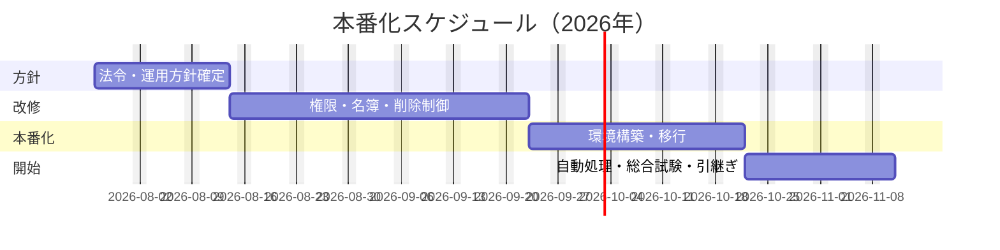

# ご提案書 — 白馬樹海 民宿管理システム本番化

**作成日**: 2026-07-14  
**ご提案金額**: 1,040万円（税別）  
**想定期間**: 2026-07-27から約11週間

## ご提案の要点

現在の予約・客室・料金管理を活かしながら、宿泊者名簿として必要な情報、利用者ごとの権限、削除制限、バックアップと監視を整えます。これにより、誰がいつ何を変更したかを確認でき、誤削除や期限到来予約の処理漏れを減らせます。既存機能の全面作り直しではなく、本番運用に不足する部分を段階的に追加します。法令上の記録項目と自治体運用を最初に確定することを着手条件とします。

## 解決する課題

| 現在の課題                       | 導入後                                         |
| -------------------------------- | ---------------------------------------------- |
| 住所など宿泊者名簿の情報が不足   | 必要項目をまとめて記録・出力できる             |
| 利用者確認がなく、操作範囲が同じ | 担当、責任者、管理者で操作を分ける             |
| 取消・退房済み情報を削除できる   | 保存期限と承認を確認してから削除する           |
| 定時処理が複数台で重複する可能性 | 1回だけ処理し、失敗は通知・再実行できる        |
| 障害時の確認先と復旧手順が未整備 | 日次確認、通知、バックアップ復元手順を用意する |

## 実施範囲と費用

| 段階              | 内容                                           |         期間 |          費用 |
| ----------------- | ---------------------------------------------- | -----------: | ------------: |
| 1. 方針確定       | 法令・自治体、保存、権限、停止許容を合意       |        2週間 |       120万円 |
| 2. 安全な業務運用 | ログイン、権限、宿泊者名簿、変更履歴、削除制御 |        4週間 |       360万円 |
| 3. 本番環境       | 安全なクラウド環境、移行、バックアップ、配備   |        3週間 |       320万円 |
| 4. 運用開始       | 自動処理、監視、総合試験、引継ぎ               |        2週間 |       240万円 |
| **合計**          | **104人日相当**                                | **約11週間** | **1,040万円** |

## お渡しするもの

- ログインと3段階の操作権限を備えた管理システム
- 住所、連絡先、該当する外国人宿泊者情報を含む名簿・CSV
- 変更履歴、保存期限、承認付き削除の仕組み
- 安全な本番環境、バックアップ、復元確認、更新手順
- 自動チェックアウト、失敗通知、管理者による再実行
- テスト結果、操作説明、日次監視・障害対応手順

## 完了の判断基準

1. 権限のない利用者が名簿閲覧・削除・管理操作をできない。
2. 必要な名簿項目を登録・検索・CSV出力でき、保存期限内は削除できない。
3. 予約重複、料金、入退室、清掃の主要業務試験が成功する。
4. 自動チェックアウトが重複せず、失敗時に通知・再実行できる。
5. バックアップから復元でき、日次確認と障害対応を担当者が実施できる。

## 導入後の費用

| 区分                         |     月額目安 |
| ---------------------------- | -----------: |
| クラウド利用料               |      1.5万円 |
| 通常の監視・更新・問合せ対応 |       35万円 |
| 障害対応の平均見込み         |       14万円 |
| **合計**                     | **50.5万円** |

3年間の総費用は、初期費用と運用を合わせ **約2,858万円** を見込む。高可用構成や夜間休日の即時対応を求める場合は別途見積もる。

## 主なリスクと対策

| リスク                         | 対策                                        |
| ------------------------------ | ------------------------------------------- |
| 自治体ごとの名簿運用が未確認   | 第1段階で管轄窓口と項目・提出形式を確認する |
| 既存データに住所等がない       | 移行対象を一覧化し、補完・例外承認を行う    |
| 新しいログイン方式で現場が混乱 | 検証環境で操作説明と受入試験を行う          |
| 移行時に業務を止める必要       | 短時間の切替枠と戻し手順を事前承認する      |
| 月額費用が利用量で変わる       | 予算通知を設定し、開始2か月後に見直す       |

## 着手前にご回答いただきたいこと

- このシステムを法定の宿泊者名簿の正本として使用するか。
- 管轄自治体、必要な追加項目、保存・提出方法。
- 社内ログイン基盤、利用者と責任者、削除承認者。
- 許容停止時間、復旧目標、夜間休日対応の要否。
- 既存予約への不足情報の補完方法と開始希望日。

上記を第1段階で確定後、範囲変更がある場合は費用・期間への影響を提示し、承認を得てから進める。
