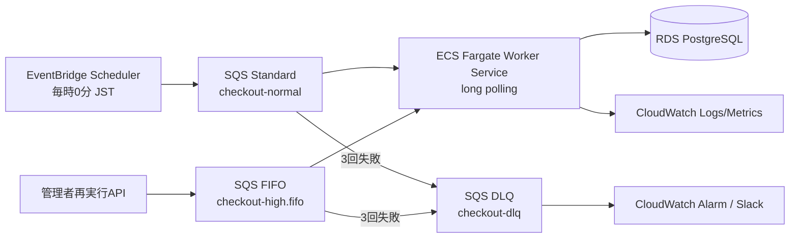
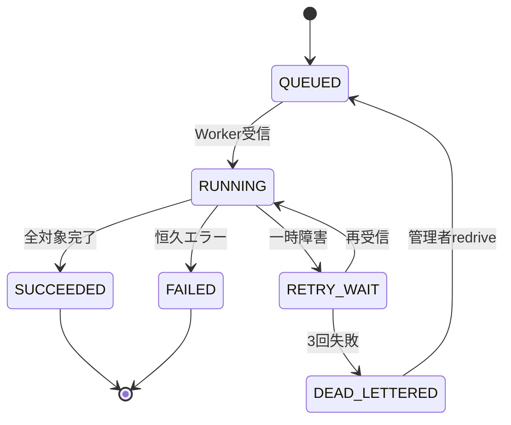

# ジョブ／バッチAPI詳細設計書

**作成日**: 2026-07-14  
**対象ジョブ**: `checkout_sync`（期限到来予約の自動チェックアウト）  
**前提**: `04.detail-design.md`

## 1. 目的と移行方針

現行の `CheckoutScheduler` はWebプロセス内で毎時実行されるため、ECSを複数タスクにすると重複実行する。目標構成では EventBridge Scheduler、SQS、軽量なECS Worker Serviceへ分離し、Web modeのschedulerを無効化する。

完了条件は、同じ予定時刻のメッセージを複数回受信しても結果が一度だけ反映され、失敗が最大3回再試行され、最終失敗がDLQとSlackへ通知されることである。

## 2. 構成



通常実行はStandard queue、管理者による緊急再実行はFIFO queueを使う。FIFOの `MessageGroupId` は `checkout_sync`、`MessageDeduplicationId` は冪等キーとする。Workerはhigh queueを先に短pollし、対象がなければnormal queueを20秒long pollする。業務処理が成功した場合だけmessageを削除する。

## 3. ジョブ共通スキーマ

```json
{
  "schemaVersion": 1,
  "jobId": "018f6d5e-6c9a-7c0f-a8d5-8b506e6f1b37",
  "jobType": "checkout_sync",
  "idempotencyKey": "checkout_sync:2026-07-14T12:00:00+09:00",
  "scheduledAt": "2026-07-14T12:00:00+09:00",
  "requestedBy": "eventbridge",
  "traceId": "01J...",
  "payload": { "businessDate": "2026-07-14", "dryRun": false }
}
```

| 項目                 | 必須 | 制約                              |
| -------------------- | ---: | --------------------------------- |
| schemaVersion        |  Yes | 現在1。不明versionは再試行せずDLQ |
| jobId                |  Yes | UUIDv7                            |
| jobType              |  Yes | `checkout_sync`                   |
| idempotencyKey       |  Yes | 200文字以内、DB UNIQUE            |
| scheduledAt          |  Yes | ISO 8601、Asia/Tokyoの予定時刻    |
| requestedBy          |  Yes | `eventbridge` または user subject |
| traceId              |  Yes | ログ相関ID                        |
| payload.businessDate |  Yes | JST業務日                         |
| payload.dryRun       |  Yes | trueは更新せず件数のみ            |

メッセージに氏名等の個人情報を含めない。

## 4. 状態管理



`jobs` は `id, job_type, idempotency_key, status, queue_name, attempt_count, scheduled_at, started_at, completed_at, processed_count, skipped_count, failed_count, last_error_code, last_error_summary, requested_by, trace_id` を持つ。エラー概要にPIIやstack traceを保存しない。

## 5. スケジュール

| 項目                 | 設定                                            |
| -------------------- | ----------------------------------------------- |
| Schedule             | `cron(0 * * * ? *)`                             |
| Time zone            | `Asia/Tokyo`                                    |
| Flexible time window | OFF                                             |
| Retry                | EventBridge配送は最大3回、最大イベント経過1時間 |
| Payload              | scheduledAtとbusinessDateを実行時に生成         |

Webの `@Scheduled` は移行期間のみ `LEGACY_CHECKOUT_SCHEDULER_ENABLED=false` を既定にし、本番では常にfalseとする。

## 6. Worker処理

1. SQSから受信したメッセージのsize、schemaVersion、必須項目を検証する。
2. `jobs.idempotency_key` をINSERTする。既存SUCCEEDEDならメッセージを削除して終了する。
3. 既存RUNNINGでlease期限内なら再処理せず、可視性timeout後の再受信に委ねる。
4. `checkout_reservations` から最大100件を `FOR UPDATE SKIP LOCKED` で取得する。
5. 各予約を再判定し、状態を `CHECKED_OUT`、客室を `CLEANING_REQUIRED` に更新し、監査ログを追加する。
6. 100件残っていれば同一job内で次のbatchを処理する。最大5分で打ち切り、継続メッセージを発行する。
7. `jobs` の件数・状態を更新し、成功メトリクスを発行してSQSメッセージを削除する。

同一jobの排他にはDBの一意制約とleaseを使う。業務更新は予約1件ごとのトランザクションとし、1件の不正データで他件を止めない。個別恒久エラーは監査とfailed_countへ記録し、全体結果を `SUCCEEDED_WITH_WARNINGS` として管理者へ通知する。

## 7. 再試行・DLQ

| エラー          | 例                                  | 処理                               |
| --------------- | ----------------------------------- | ---------------------------------- |
| 一時            | DB接続timeout、AWS 5xx、throttling  | 例外を返しSQS再試行                |
| 競合            | lock timeout、serialization failure | jitter付きで最大3回、以後SQS再試行 |
| 恒久（個別）    | 不正状態、対象消失                  | 当該対象をskipし監査、他件続行     |
| 恒久（message） | schema不明、必須欠落                | `FAILED`記録後DLQへ送る            |
| 認証/設定       | secret不足、IAM拒否                 | 即失敗、アラーム、再試行後DLQ      |

- SQS visibility timeout: 450秒、Worker timeout: 300秒、receive wait: 20秒。
- Redrive policy: `maxReceiveCount=3`。DLQ保持14日。
- 自動redriveはしない。原因修正、dry-run、管理者承認後にhigh queueへ新jobIdで投入し、元jobIdを `parent_job_id` で関連付ける。

## 8. 管理API

### `GET /api/admin/jobs`

Query: `jobType`, `status`, `scheduledFrom`, `scheduledTo`, `page`, `size`。ADMINのみ。応答は件数・時刻・エラーコードを返し、メッセージ本文やPIIは返さない。

### `POST /api/admin/jobs/checkout-sync`

```json
{ "businessDate": "2026-07-14", "dryRun": true, "reason": "障害復旧確認" }
```

最初はdry-runを推奨する。理由必須、最大31日前まで、同じbusinessDateの実行中jobがあれば409。202でjobIdを返し、high FIFOへ投入する。実実行はADMINかつ再認証済みセッションを要求し、監査する。

## 9. IAM・ネットワーク

- Scheduler role: normal queueへの `sqs:SendMessage` のみ。
- Web task role: high queueへの送信とjob参照に必要な最小権限。
- Worker task role: 対象queueのreceive/delete/change visibility、Secrets読取、ログ・メトリクス送信、必要なDB/S3操作。
- queue policyは該当roleとアカウントに限定し、SSE-KMS、VPC endpointを利用する。
- DB userは必要テーブルのSELECT/UPDATE/INSERTのみ。DDL権限を与えない。

## 10. 監視とSLO

| 指標                            | 目標／閾値                          |
| ------------------------------- | ----------------------------------- |
| 開始遅延                        | p95 60秒以下                        |
| 実行時間                        | p95 300秒以下                       |
| 成功率                          | 月間99.9%以上                       |
| `ApproximateAgeOfOldestMessage` | 300秒超でWarning、900秒超でCritical |
| DLQ件数                         | 1件以上でCritical                   |
| 連続失敗                        | 2回でWarning、3回でCritical         |
| 予定対象の未退房                | 実行30分後に1件以上でCritical       |

メトリクスは `JobStarted`, `JobSucceeded`, `JobFailed`, `JobDurationMs`, `ProcessedCount`, `SkippedCount`, `CheckoutLagSeconds`。dimensionはEnvironmentとJobTypeに限定し、jobIdをdimensionにしない。

## 11. テスト

- 同じmessageを並列10回受信しても状態更新・監査が一度である。
- 0件、1件、100件、101件、500件、日付境界、夏時間に依存しないJST境界。
- DB停止、timeout、visibility timeout超過、Worker強制終了、3回失敗、DLQ redrive。
- 不正schema、巨大message、権限拒否、secret rotation、PII非出力。
- Web taskを2台へscaleしてもschedulerが動かない。

## 12. リリース・ロールバック

1. jobs table、queue、DLQ、alarmを作成し、Workerをdry-runで検証する。
2. EventBridgeを無効状態で配備し、管理APIから本実行する。
3. Web schedulerを無効化し、直後にEventBridgeを有効化する。
4. 24時間は対象残件を毎時確認する。
5. 障害時はEventBridgeを停止し、単一Web taskのlegacy schedulerへ一時的に戻す。重複防止DB制約は維持する。
