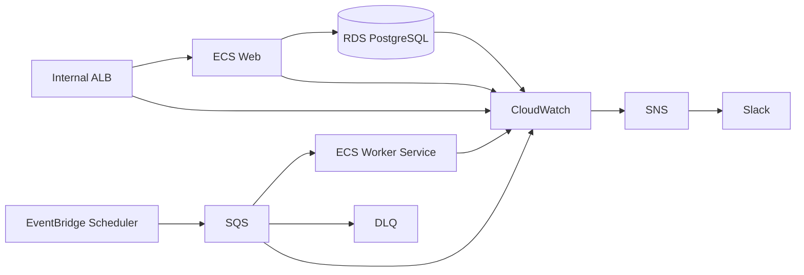

# 運用・監視設計書

**作成日**: 2026-07-14  
**対象環境**: AWS本番（ap-northeast-1）  
**通知**: CloudWatch Alarm → SNS → AWS Chatbot / Slack

## 1. 運用目標

| 項目         | 暫定目標                                 |
| ------------ | ---------------------------------------- |
| 月間可用性   | 99.5%以上                                |
| API応答      | 通常API p95 500ms、一覧 p95 1秒以下      |
| checkout job | 成功率99.9%、開始p95 60秒、完了p95 300秒 |
| RPO / RTO    | 24時間 / 4時間（要顧客承認）             |
| 受付時間     | 09:00〜18:00 JST、重大障害のみ時間外通知 |

## 2. 監視対象



構文監視だけでなく、予約作成、一覧取得、期限到来予約の残件という業務状態を監視する。監視ログへ個人情報を含めない。

## 3. アラーム一覧

| ID     | 対象・条件                 | Warning   | Critical            | 初動                         |
| ------ | -------------------------- | --------- | ------------------- | ---------------------------- |
| WEB-01 | ALB 5XX率 5分              | 1%超      | 5%超                | deploy/DB/stack trace確認    |
| WEB-02 | TargetResponseTime p95 5分 | 1秒超     | 3秒超               | slow query、CPU、依存先確認  |
| WEB-03 | HealthyHostCount           | -         | 1未満 2分           | ECS event、health、rollback  |
| ECS-01 | CPU/Memory 10分            | 70%       | 85%                 | task増強、leak確認           |
| ECS-02 | task再起動                 | 2回/15分  | 5回/15分            | exit code、OOM、secret確認   |
| DB-01  | CPU 10分                   | 70%       | 85%                 | slow SQL、lock確認           |
| DB-02  | FreeStorageSpace           | 20%未満   | 10%未満             | 増量、log/一時領域確認       |
| DB-03  | DatabaseConnections        | maxの70%  | maxの85%            | pool/idle接続確認            |
| DB-04  | FreeableMemory             | 20%未満   | 10%未満             | query、instance変更          |
| JOB-01 | oldest message age         | 300秒     | 900秒               | Worker起動、queue確認        |
| JOB-02 | job連続失敗                | 2回       | 3回                 | error code、依存先確認       |
| JOB-03 | DLQ visible messages       | -         | 1件以上             | redrive禁止、原因調査        |
| JOB-04 | 未退房残件                 | -         | 実行30分後に1件以上 | dry-run、手動再実行          |
| SEC-01 | 401/403急増                | 基線の3倍 | 基線の10倍          | IdP/攻撃/設定変更確認        |
| BAK-01 | backup失敗                 | -         | 1回                 | RDS event、容量、AWS障害確認 |

すべて `Environment=prod` をdimensionとし、Alarmの欠測値扱いを明示する。低トラフィックの率アラームは最低リクエスト件数と組み合わせる。

## 4. Slack通知

Channelは `#minshuku-alerts`（重大）、`#minshuku-ops`（警告・日次）を仮称とする。

```text
[CRITICAL][prod][JOB-03] checkout DLQ に 1 件あります
発生: 2026-07-14 12:08 JST
影響: 自動チェックアウトが未完了の可能性
指標: queue=checkout-dlq, visible=1
Runbook: 09.ops-monitoring.md / 7.3
担当: @oncall-minshuku
禁止事項: 原因確認前にredriveしない
```

復旧通知には発生、検知、一次対応、復旧時刻、影響件数、恒久対策ticketを含める。氏名、住所、予約番号全文、旅券情報を貼らない。

## 5. 日次ヘルスチェック

毎営業日09:30 JST、所要10分、運用担当が実施する。

1. CloudWatch Alarmで`ALARM`と`INSUFFICIENT_DATA`を確認する。
2. ECS desired/running task数、直近deploy、再起動数を確認する。
3. RDS CPU、接続、空き容量、backup完了を確認する。
4. checkout jobの直近24回、処理数、失敗数、最終成功時刻を確認する。
5. normal/high queue ageとDLQ件数が0であることを確認する。
6. 期限到来なのに未退房の件数をSQLで確認する。
7. 結果を `#minshuku-ops` へ定型投稿し、異常はticket化する。

```sql
SELECT count(*) AS overdue_count
FROM reservations
WHERE status IN ('RESERVED', 'CHECKED_IN')
  AND check_out_date <= CURRENT_DATE
  AND deleted_at IS NULL;
```

```text
[DAILY][prod] 2026-07-14 09:30 JST
Web=OK / RDS=OK / Backup=OK
checkout last24h=24 success, failed=0, overdue=0, DLQ=0
担当: user-subject（個人情報なし）
```

## 6. 定期運用

| 周期   | 作業                                             | 証跡             |
| ------ | ------------------------------------------------ | ---------------- |
| 毎日   | 上記ヘルスチェック、alarm確認                    | Slack投稿/ticket |
| 毎週   | error上位、slow query、容量予測、未処理audit確認 | 週次レポート     |
| 毎月   | SLO、コスト、権限変更、脆弱性、パッチ候補        | 月次レビュー     |
| 四半期 | RDS復元演習、DLQ訓練、権限棚卸し、連絡網確認     | 演習記録         |
| 半年   | 保持期限到来データ、S3 Lifecycle、監査ログ確認   | 削除承認記録     |
| 年次   | DR、法令・自治体運用、委託先、SLA見直し          | 年次承認         |

## 7. 障害対応Runbook

### 7.1 Web/API停止

1. 影響範囲、開始時刻、直近deployを確認し、重大度を宣言する。
2. ALB target、ECS event、task logs、RDS接続を確認する。
3. 直近deploy起因なら前revisionへrollbackする。
4. DB障害なら書込操作を止め、AWS statusとRDS eventを確認する。
5. 復旧後に予約件数・状態を照合し、利用者へ復旧通知する。

### 7.2 DB高負荷／容量不足

1. Performance Insightsで上位SQL、lock、接続元を特定する。
2. runaway queryを影響確認後に停止し、不要なbatchを一時停止する。
3. ストレージは自動拡張上限を確認し、余裕30%以上へ増量する。
4. データ削除を緊急対処に使わない。Index/SQL/instance変更を承認後に実施する。

### 7.3 DLQ発生

1. EventBridgeと管理APIからの新規再実行を一時停止する。
2. messageのjobId、schemaVersion、error code、関連ログを確認する。本文をSlackへ転記しない。
3. DB接続、IAM、secret、migration、データ状態を切り分ける。
4. 修正後、同じbusinessDateでdry-runし、対象件数を確認する。
5. ADMIN承認後、high queueへredriveし、完了と未退房0件を確認する。
6. 元job、再実行job、原因、対策をincidentへ記録する。

### 7.4 誤更新／個人情報事故

1. 追加変更を止め、証拠保全し、セキュリティ・個人情報責任者へ即時連絡する。
2. 対象データ、期間、閲覧・外部送信の有無をauditとアクセスログから特定する。
3. 独断でログやデータを削除しない。復旧はスナップショットの別環境復元で差分確認する。
4. 個人情報保護委員会への報告・本人通知要否を責任者が判断し、法定期限で実施する。

## 8. バックアップ／復元

- RDS自動backupを毎日、保持7日（SLA確定後35日検討）、削除保護を有効化する。
- 本番へ直接上書き復元せず、新しいRDSへPITRし、整合性確認後に接続先を切り替える。
- 復元試験は四半期ごとに、所要時間、復元時点、Flyway version、予約・名簿件数、主要APIを確認する。
- S3はversioning、SSE-KMS、Block Public Access、Lifecycleを有効にする。鍵の削除待機期間を設定する。

## 9. リリース監視

リリース前にmigration snapshot、Flyway validate、rollback手順を確認する。リリース後60分は5分間隔で5XX、latency、ECS再起動、DB接続、予約作成、checkout残件を確認する。error budgetを超える変更は停止する。

## 10. 役割分担

| 役割           | 責務                                          |
| -------------- | --------------------------------------------- |
| 業務運用       | 日次確認、予約・名簿の業務判断、一次連絡      |
| アプリ保守     | API/Worker調査、deploy/rollback、データ修正案 |
| 基盤保守       | AWS、RDS、network、backup、IAM                |
| 管理責任者     | 削除・redrive・緊急変更・対外連絡の承認       |
| 個人情報責任者 | 漏えい評価、当局・本人対応、保持方針          |

## 11. FAQ

**Q. DLQのメッセージをすぐ戻してよいか。**  
A. 不可。原因が残っていると再失敗や重複影響が起きるため、dry-runとADMIN承認後に行う。

**Q. 自動退房が遅れた場合、予約を手作業で削除するか。**  
A. 削除しない。状態を確認し、管理APIで再実行する。法定保存対象は保持する。

**Q. Alarmが自然復旧したらticketは不要か。**  
A. Critical、DLQ、個人情報、データ不整合は自然復旧でも記録と原因確認が必要である。

**Q. CloudWatch Logsへ予約内容を出してよいか。**  
A. 不可。jobId、予約内部ID、error code、件数で追跡し、氏名・住所・連絡先・旅券情報は出さない。
